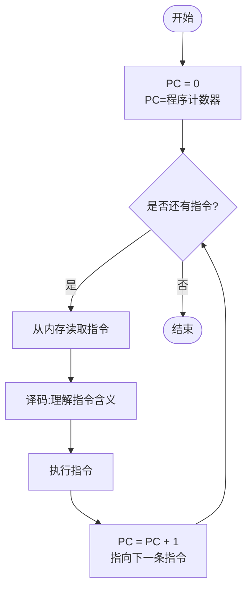
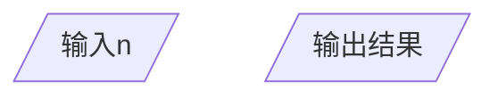
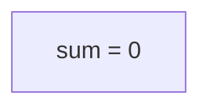
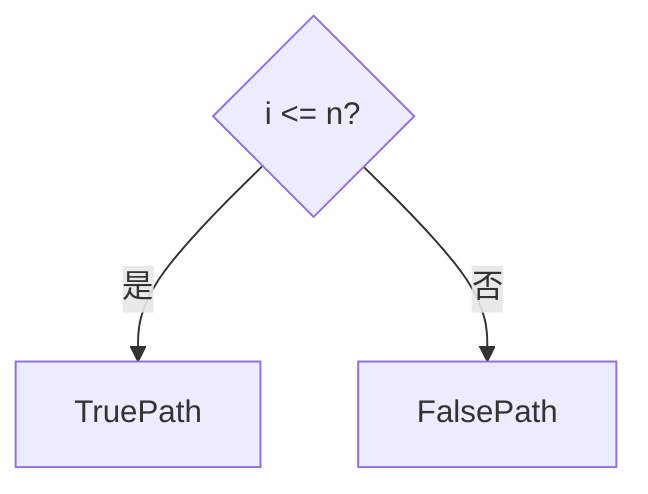
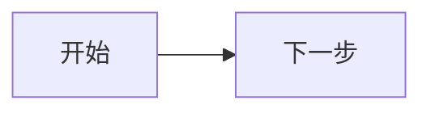
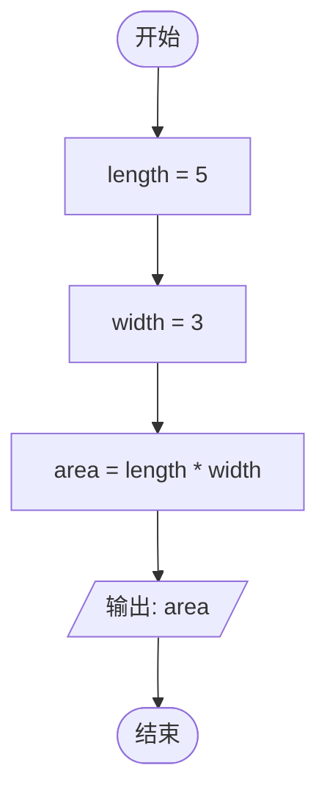

# 流程图

## 引言

在前面的章节中,我们学习了三种基本的程序控制结构:
- **顺序语句**(第6章):程序按从上到下的顺序执行
- **条件语句**(第7章):根据条件选择执行不同的代码
- **循环语句**(第8章):重复执行某些代码

这些结构让程序能够处理各种复杂的情况。但是,当程序变得比较复杂时,仅靠阅读代码来理解逻辑可能会有些困难。

有没有一种方法,可以用**图形**的方式来表示程序的执行流程呢?

答案是:**有!这就是流程图。**

**流程图**(Flowchart)是用图形符号来表示程序执行流程的图示方法。它能帮助我们:
- 更清晰地理解程序的逻辑
- 在编写代码之前设计程序
- 与他人交流程序的设计思路
- 调试和优化程序

这一章,我们将学习:
- 流程图的基本符号
- 如何用流程图表示顺序、条件和循环
- 如何从流程图写出代码
- 如何从代码画出流程图
- **什么是算法** 💡
- **用流程图表示计算机的工作过程** 💡

## 💡 什么是算法?

在学流程图之前,我们先了解一个重要的概念——**算法**(Algorithm)。

**算法**就是**解决问题的步骤**。

**生活中的例子** 🍳
比如"做番茄炒蛋"的算法:
1. **准备食材**:番茄2个、鸡蛋3个
2. **处理食材**:番茄切块、鸡蛋打散
3. **炒鸡蛋**:热锅加油,倒入鸡蛋炒熟
4. **炒番茄**:加入番茄翻炒
5. **调味**:加盐,翻炒均匀
6. **装盘**:盛到盘子里

**这就是一个算法!**它告诉我们:
- 从哪里开始(准备食材)
- 每一步做什么(炒鸡蛋、炒番茄)
- 什么时候结束(装盘)

**编程中的算法** 💻
我们前面学过的程序也是算法:

```python
# 计算1到n的和(算法)
n = int(input("请输入n:"))  # 步骤1:输入n
total = 0                     # 步骤2:初始化总和
i = 1                         # 步骤3:初始化计数器

while i <= n:                  # 步骤4:循环累加
    total = total + i
    i = i + 1

print(total)                   # 步骤5:输出结果
```

**算法的三个特征**:
1. **有输入**:比如上面的程序输入n
2. **有步骤**:一步一步执行(初始化→循环→输出)
3. **有输出**:最后输出总和

**为什么流程图和算法是一回事?** 🤔
- **算法**:用**文字**描述解决问题的步骤
- **流程图**:用**图形**描述解决问题的步骤

它们描述的是同一件事,只是表达方式不同!

> **👨‍🏫 给家长的Tips**
>
> **知识点补充(针对家长):**
> - 算法是计算机科学的核心概念
> - 一个算法可以用多种方式表示:
>   - 自然语言(文字描述)
>   - 流程图(图形表示)
>   - 伪代码(介于自然语言和代码之间)
>   - 编程语言(Python、C++等)
> - 流程图是算法的一种"可视化"表示
>
> **如何给孩子讲解:**
> - 用"做菜的菜谱"类比算法
> - 菜谱可以用文字写,也可以画成图示
> - 流程图就是程序的"图示版菜谱"
> - 强调:算法是"想法",流程图是"画出来的想法"

## 💡 用流程图表示计算机的工作过程

在第6章,我们学习了CPU是如何执行指令的:
- **取指令**→**译码**→**执行**→**重复**

现在我们用流程图来表示CPU的工作过程:

### CPU的指令执行循环



**流程图解释**:
1. **开始**:启动计算机
2. **初始化**:PC(程序计数器)设为0,指向第一条指令
3. **判断**:是否还有指令要执行?
4. **取指**:从内存读取当前指令
5. **译码**:CPU理解这条指令要做什么
6. **执行**:CPU执行指令(加法、减法、判断等)
7. **更新PC**:PC加1,指向下一条指令
8. **返回**:回到第3步,继续执行
9. **结束**:程序执行完毕

**这正好解释了为什么计算机这么快!** ⚡
- 这个循环每秒可以执行**几十亿次**!
- 每次循环(取指→译码→执行)只需要**纳秒**(1纳秒=0.000000001秒)

> **👨‍🏫 给家长的Tips**
>
> **知识点补充(针对家长):**
> - CPU的工作过程就是一个"无限循环"
> - 术语叫"指令循环"(Instruction Cycle)
> - 每个时钟周期执行一次循环
> - 3GHz CPU = 每秒30亿次指令循环
>
> **如何给孩子讲解:**
> - 用"传送带"类比:
>   - CPU就像一个工人
>   - 指令就像传送带上的零件
>   - 工人不断拿起零件(取指)
>   - 理解零件怎么用(译码)
>   - 处理零件(执行)
>   - 然后拿起下一个零件...
> - 强调:这个循环比人类快**亿万倍**
>
> **数学小计算** 🧮:
> - 如果CPU主频是3GHz(每秒30亿个周期)
> - 执行1亿条简单指令需要:100,000,000 ÷ 3,000,000,000 = 0.03秒!
> - 这就是为什么计算机适合做重复性工作!

### 程序执行流程图

让我们用一个简单的程序来看CPU是如何执行的:

**代码**:
```python
# 计算2的3次方
result = 1
result = result * 2  # 第1次乘法
result = result * 2  # 第2次乘法
result = result * 2  # 第3次乘法
print(result)
```

**CPU执行过程流程图**:

```
   ┌─────────┐
   │  开始   │
   └────┬────┘
        ↓
   ┌──────────────────┐
   │ PC = 0 (指向第1行)│
   └────┬─────────────┘
        ↓
      ↑
     ╱ ╲
    ╱   ╲
   ╱     ╲
  ╱PC<4?  ╲───┐ ← 代码共4行
 ╱ (判断)  ╲   │
   ╱   ╲       │
 是    否      │
 ╱      ╲      │
 ↓        ╲     │
┌───────┐  ╲    │
│执行指令│   ╲   │
│PC指向的│    ↓  │
└───┬───┘ ┌─────┘
    │     │
    ↓     │
┌──────────┐│
│ PC = PC+1││ → 指向下一条指令
└─────┬────┘│
      │     │
      └─────┘
           ↓
   ┌─────────────────╲
  ╱ 输出: result     ╲
 ╱────────────────────╲
        ↓
   ┌─────────┐
   │  结束   │
   └─────────┘
```

**执行过程详解**:
1. **PC=0**:执行第1行 `result = 1`,然后PC变为1
2. **PC=1**:执行第2行 `result = result * 2`,然后PC变为2
3. **PC=2**:执行第3行 `result = result * 2`,然后PC变为3
4. **PC=3**:执行第4行 `result = result * 2`,然后PC变为4
5. **PC=4**:PC>=4,退出循环,执行下一条指令(print)
6. **输出**:打印result的值(8)

> **👨‍🏫 给家长的Tips**
>
> **重要概念:**
> - **程序计数器(PC)**:CPU中的"书签",记录执行到哪一行
> - PC从0开始,每执行一行就+1
> - 当PC超出程序行数时,程序结束
> - 这就是"顺序执行"的硬件原理!
>
> **如何给孩子讲解:**
> - 用"看书"类比:
>   - PC就像你的"手指",指到哪行就读哪行
>   - 读完后,手指移到下一行(PC+1)
>   - 读到最后一页,书就结束了
> - 强调:CPU每秒可以做这样的"翻页"几十亿次!

### 流程图与算法的关系

现在我们理解了:
- **算法** = 解决问题的步骤(文字描述)
- **流程图** = 算法的图形表示
- **程序** = 算法的代码实现
- **CPU执行** = 按照流程图的步骤执行

**四种表示方式的对比**:

| 表示方式 | 例子 | 优点 | 缺点 |
|---------|------|------|------|
| **算法**(文字) | "1.输入n 2.初始化sum=0 3.循环累加 4.输出" | 易理解,不要求技术 | 不够精确,有歧义 |
| **流程图**(图形) | 用符号和箭头表示 | 直观清晰,逻辑一目了然 | 复杂程序图画起来麻烦 |
| **程序**(代码) | `for i in range(n+1): sum+=i` | 精确,计算机能执行 | 需要学习编程语法 |
| **CPU执行** | 取指→译码→执行的循环 | 计算机真正的工作方式 | 过于底层,不适合设计算法 |

> **👨‍🏫 给家长的Tips**
>
> **教学建议:**
> - 告诉孩子:程序员写代码时,通常的流程是:
>   1. 先想算法(用文字描述思路)
>   2. 画流程图(把思路图形化)
>   3. 写代码(把流程图翻译成Python)
> - 这就是为什么我们要学流程图——它是"想法"和"代码"之间的桥梁!
> - 鼓励孩子养成"先画流程图,再写代码"的习惯

## 流程图的基本符号

流程图使用不同的图形符号来表示不同的操作。让我们先认识这些符号。

### 1. 开始/结束符号(圆角矩形)


**作用**:表示程序的开始或结束

**特点**:
- 通常使用圆角矩形或椭圆形
- "开始"符号只有一个向外的箭头
- "结束"符号只有一个向内的箭头

### 2. 输入/输出符号(平行四边形)



**作用**:表示输入(input)或输出(print)操作

**示例**:
- `n = int(input("请输入n:"))`
- `print("结果是:", sum)`

### 3. 处理符号(矩形)



**作用**:表示计算、赋值等处理操作

**示例**:
- `sum = sum + i`
- `i = i + 1`
- `area = length * width`

### 4. 判断符号(菱形)



**作用**:表示条件判断

**特点**:
- 有两个出口:True(是)和False(否)
- 用于if语句和循环的条件

### 5. 流程线(箭头)



**作用**:表示程序的执行方向

### 符号总结表

| 符号 | 名称 | 作用 | Python示例 |
|------|------|------|-----------|
| ⬭ | 开始/结束 | 程序的开始或结束 | - |
| ╱ ╲ | 输入/输出 | input()或print() | input(), print() |
| ┌─┐ | 处理 | 计算、赋值 | sum = 0, i = i + 1 |
| ◇ | 判断 | 条件判断 | if, while, for |
| ↓ | 流程线 | 执行方向 | - |

> **给家长的小贴士**:
> - 建议让孩子把这些符号画在卡片上
> - 可以玩"配对游戏":将符号与对应的代码配对
> - 强调每个符号的形状和用途的关联
> - 菱形有尖角,像路口需要选择方向
> - 平行四边形倾斜,像数据进进出出

## 用流程图表示顺序语句

顺序语句是最简单的程序结构,按照从上到下的顺序执行。

### 示例1:计算长方形面积

**代码**:
```python
# 计算长方形面积
length = 5
width = 3
area = length * width
print(area)
```

**流程图**:


**要点**:
- 箭头始终向下,表示顺序执行
- 每个步骤按顺序完成后再进行下一个
- 没有分支,没有循环

### 示例2:带输入的顺序程序

**代码**:
```python
# 输入长和宽,计算面积
length = int(input("请输入长度:"))
width = int(input("请输入宽度:"))
area = length * width
print(f"面积是:{area}")
```

**流程图**:
```
   ┌─────────┐
   │  开始   │
   └────┬────┘
        ↓
   ╱─────────────────╲
  ╱ 输入: length     ╲
 ╱─────────────────────╲
        ↓
   ╱─────────────────╲
  ╱  输入: width     ╲
 ╱─────────────────────╲
        ↓
   ┌──────────────────┐
   │ area = l * w    │
   └────┬─────────────┘
        ↓
   ╱─────────────────╲
  ╱ 输出: area       ╲
 ╱─────────────────────╲
        ↓
   ┌─────────┐
   │  结束   │
   └─────────┘
```

> **给家长的小贴士**:
> - 顺序语句的流程图最简单:一条直线向下
> - 可以让孩子"用手指走一遍"流程图
> - 强调:一步接一步,不能跳跃
> - 可以用生活中的例子类比:做菜的步骤、早晨起床的流程

### 练习1:画出温度转换程序的流程图

**题目**:画流程图表示下面的程序。

```python
# 温度转换:摄氏度转华氏度
celsius = float(input("请输入摄氏度:"))
fahrenheit = celsius * 9 / 5 + 32
print(f"华氏度是:{fahrenheit}")
```

<details>
<summary>👉 点击查看答案</summary>

```
   ┌─────────┐
   │  开始   │
   └────┬────┘
        ↓
   ╱────────────────────╲
  ╱ 输入: celsius       ╲
 ╱────────────────────────╲
        ↓
   ┌──────────────────────────┐
   │ f = c * 9 / 5 + 32       │
   └────┬─────────────────────┘
        ↓
   ╱────────────────────╲
  ╱ 输出: fahrenheit    ╲
 ╱────────────────────────╲
        ↓
   ┌─────────┐
   │  结束   │
   └─────────┘
```
</details>

## 用流程图表示条件语句

条件语句需要根据条件判断选择执行不同的代码分支,在流程图中用**菱形**表示。

### 示例1:简单的if语句

**代码**:
```python
# 判断数字是否为正数
num = int(input("请输入一个数字:"))

if num > 0:
    print("这是正数")

print("程序结束")
```

**流程图**:
```
   ┌─────────┐
   │  开始   │
   └────┬────┘
        ↓
   ╱─────────────────╲
  ╱  输入: num      ╲
 ╱─────────────────────╲
        ↓
      num > 0?
     ╱    ╲
   是   否
   ╱      ╲
   ↓        ╲
┌────────┐   ╲
│输出"正数"│   ╲
└────┬────┘   ╲
     ↓        ╲
     └────┬────┘
          ↓
   ╱─────────────────╲
  ╱ 输出"程序结束"   ╲
 ╱─────────────────────╲
        ↓
   ┌─────────┐
   │  结束   │
   └─────────┘
```

**要点**:
- 菱形表示判断条件
- "是"(True)分支和"否"(False)分支
- 两个分支最终汇合到一起

### 示例2:if-else语句

**代码**:
```python
# 判断奇偶数
num = int(input("请输入一个数字:"))

if num % 2 == 0:
    print("这是偶数")
else:
    print("这是奇数")

print("程序结束")
```

**流程图**:
```
   ┌─────────┐
   │  开始   │
   └────┬────┘
        ↓
   ╱─────────────────╲
  ╱  输入: num      ╲
 ╱─────────────────────╲
        ↓
    num % 2 == 0?
     ╱      ╲
   是       否
   ╱        ╲
   ↓          ↓
┌────────┐ ┌────────┐
│输出"偶数"│ │输出"奇数"│
└────┬────┘ └────┬───┘
     └────┬────┘
          ↓
   ╱─────────────────╲
  ╱ 输出"程序结束"   ╲
 ╱─────────────────────╲
        ↓
   ┌─────────┐
   │  结束   │
   └─────────┘
```

**要点**:
- if-else的两个分支是对称的
- 两个分支都会执行完后汇合

### 示例3:if-elif-else语句

**代码**:
```python
# 成绩等级判断
score = int(input("请输入成绩:"))

if score >= 90:
    print("优秀")
elif score >= 80:
    print("良好")
elif score >= 60:
    print("及格")
else:
    print("不及格")

print("程序结束")
```

**流程图**:
```
   ┌─────────┐
   │  开始   │
   └────┬────┘
        ↓
   ╱─────────────────╲
  ╱  输入: score    ╲
 ╱─────────────────────╲
        ↓
   score >= 90?
     ╱      ╲
   是       否
   ╱         ╲
   ↓           ↓
┌────────┐  score >= 80?
│输出"优秀"│   ╱      ╲
└────┬───┘ 是        否
     └─┬────┘        ╲
       ↓             ╲
    ┌────────┐  score >= 60?
    │输出"良好"│   ╱      ╲
    └────┬───┘ 是        否
         └─┬────┘        ╲
           ↓             ╲
        ┌────────┐  ┌────────┐
        │输出"及格"│ │输出"不及格"│
        └────┬───┘ └────┬───┘
             └────┬────┘
                  ↓
        ╱─────────────────╲
       ╱ 输出"程序结束"   ╲
      ╱─────────────────────╲
              ↓
          ┌─────────┐
          │  结束   │
          └─────────┘
```

**要点**:
- 多个条件依次判断
- 一旦某个条件为True,执行对应分支后不再判断其他条件
- 所有条件都不满足时,执行else分支

> **给家长的小贴士**:
> - 条件语句的流程图像一棵"树"
> - 强调:菱形有两个出口
> - 让孩子用手指沿着不同的路径走一遍
> - 可以画在纸上,用不同颜色的笔标记不同的路径
> - 对于if-elif-else,强调"一旦满足就不再判断"

### 练习2:画出绝对值程序的流程图

**题目**:画流程图表示下面的程序。

```python
# 计算绝对值
num = int(input("请输入一个数字:"))

if num < 0:
    num = -num

print(f"绝对值是:{num}")
```

<details>
<summary>👉 点击查看答案</summary>

```
   ┌─────────┐
   │  开始   │
   └────┬────┘
        ↓
   ╱─────────────────╲
  ╱  输入: num      ╲
 ╱─────────────────────╲
        ↓
      num < 0?
     ╱      ╲
   是       否
   ╱        ╲
   ↓          ╲
┌──────────┐   ╲
│ num = -num│   ╲
└────┬─────┘   ╲
     └────┬────┘
          ↓
   ╱────────────────────╲
  ╱ 输出: num (绝对值)  ╲
 ╱────────────────────────╲
        ↓
   ┌─────────┐
   │  结束   │
   └─────────┘
```
</details>

## 用流程图表示循环语句

循环语句的流程图与条件语句类似,也用菱形表示判断,但有一个重要的区别:**循环有返回箭头,形成回路**。

### 示例1:while循环

**代码**:
```python
# 打印1到5
count = 1

while count <= 5:
    print(count)
    count = count + 1

print("循环结束")
```

**流程图**:
```
   ┌─────────┐
   │  开始   │
   └────┬────┘
        ↓
   ┌──────────┐
   │count = 1 │
   └────┬─────┘
        ↓
      ↑
     ╱ ╲
    ╱   ╲
   ╱     ╲
  ╱count<=5?╲───────┐
 ╱   (判断)  ╲       │
     ╱   ╲          │
   是     否         │
   ╱       ╲         │
   ↓         ╲       │
┌────────┐   ╲       │
│输出count│   ↓      │
└───┬────┘   ┌─────────┐
    ↓        │count = c │
    │        │  + 1     │
    │        └────┬────┘
    │             │
    └─────────────┘
          ↓
   ╱─────────────────╲
  ╱ 输出"循环结束"   ╲
 ╱─────────────────────╲
        ↓
   ┌─────────┐
   │  结束   │
   └─────────┘
```

**要点**:
- while循环的三个要素:
  1. 初始值:`count = 1`
  2. 条件:`count <= 5`
  3. 更新:`count = count + 1`
- 当条件为True时,执行循环体,然后**返回**再次判断条件
- 当条件为False时,退出循环

### 示例2:for循环(等价while)

**代码**:
```python
# 用for循环打印1到5
for count in range(1, 6):
    print(count)

print("循环结束")
```

**流程图**:
```
   ┌─────────┐
   │  开始   │
   └────┬────┘
        ↓
   ┌──────────────┐
   │count = range(1,6)│
   └────┬─────────┘
        ↓
      ↑
     ╱ ╲
    ╱   ╲
   ╱     ╲
  ╱count<=5?╲───────┐
 ╱   (判断)  ╲       │
     ╱   ╲          │
   是     否         │
   ╱       ╲         │
   ↓         ╲       │
┌────────┐   ╲       │
│输出count│   ↓      │
└───┬────┘   ┌──────────┐
    ↓        │count自动+1│
    │        └────┬─────┘
    │             │
    └─────────────┘
          ↓
   ╱─────────────────╲
  ╱ 输出"循环结束"   ╲
 ╱─────────────────────╲
        ↓
   ┌─────────┐
   │  结束   │
   └─────────┘
```

**要点**:
- for循环的菱形判断条件来自range()
- for循环会**自动更新**循环变量
- 流程图与while类似,但更新是自动的

### 示例3:带break的循环

**代码**:
```python
# 找第一个能被7整除的数
for i in range(1, 100):
    if i % 7 == 0:
        print(f"找到了:{i}")
        break

print("程序结束")
```

**流程图**:
```
   ┌─────────┐
   │  开始   │
   └────┬────┘
        ↓
   ┌──────────────┐
   │  i = range   │
   │   (1, 100)   │
   └────┬─────────┘
        ↓
      ↑
     ╱ ╲
    ╱   ╲
   ╱     ╲
  ╱i < 100? ╲─────┐
 ╱   (判断)  ╲     │
     ╱   ╲        │
   是     否       │
   ╱       ╲      │
   ↓         ╲    │
i % 7 == 0?       │
 ╱      ╲         │
是       否        │
 ╱        ╲       │
↓          ╲      │
┌────────┐   ╲    │
│输出: i │    ╲   │
│  break│────→╲──┘ ←─ break直接跳出
└────────┘     ╲    循环
              ↓
   ┌─────────┐
   │  结束   │
   └─────────┘
```

**要点**:
- break会立即跳出循环
- 不再返回判断条件
- 直接执行循环后的语句

### 示例4:带continue的循环

**代码**:
```python
# 打印1到10中的奇数
for i in range(1, 11):
    if i % 2 == 0:
        continue  # 跳过偶数
    print(i)

print("程序结束")
```

**流程图**:
```
   ┌─────────┐
   │  开始   │
   └────┬────┘
        ↓
   ┌──────────────┐
   │  i = range   │
   │   (1, 11)    │
   └────┬─────────┘
        ↓
      ↑
     ╱ ╲
    ╱   ╲
   ╱     ╲
  ╱i < 11? ╲──────┐
 ╱   (判断)  ╲     │
     ╱   ╲        │
   是     否       │
   ╱       ╲      │
   ↓         ╲    │
i % 2 == 0?        │
 ╱      ╲         │
是       否        │
 ╱        ╲       │
↓          ↓      │
│continue┐ ┌──────┤
│(跳过)  │ │输出 i│
└────────┘ └──┬───┘
   ↑          │
   │          │
   └──────────┘
        ↓
   ╱─────────────────╲
  ╱ 输出"程序结束"   ╲
 ╱─────────────────────╲
        ↓
   ┌─────────┐
   │  结束   │
   └─────────┘
```

**要点**:
- continue跳过本次循环的剩余代码
- 立即**返回**判断条件,进入下一次循环
- 不像break那样退出循环

> **给家长的小贴士**:
> - 循环流程图的关键是"回路"
> - 强调:条件满足时"返回"再次判断
> - 可以用"跑道"类比:跑完一圈回到起点
> - break是"离开跑道",continue是"重跑一圈"
> - 让孩子用手指沿着箭头走,体验循环

### 循环vs条件语句:流程图的区别

| 特征 | 条件语句 | 循环语句 |
|------|---------|---------|
| 菱形判断 | 有 | 有 |
| 两个分支 | 是/否 | 是/否 |
| 返回箭头 | **无** | **有** |
| 执行次数 | 一次 | 可能多次 |
| 目的 | 选择分支 | 重复执行 |

**总结**:
- 条件语句:菱形→分支→汇合→向下(无返回)
- 循环语句:菱形→分支→返回(有返回)

### 练习3:画出累加程序的流程图

**题目**:画流程图表示下面的程序。

```python
# 计算1到n的和
n = int(input("请输入n:"))

total = 0
i = 1

while i <= n:
    total = total + i
    i = i + 1

print(f"1到{n}的和是:{total}")
```

<details>
<summary>👉 点击查看答案</summary>

```
   ┌─────────┐
   │  开始   │
   └────┬────┘
        ↓
   ╱─────────────────╲
  ╱  输入: n        ╲
 ╱─────────────────────╲
        ↓
   ┌──────────┐
   │ total=0 │
   │   i=1   │
   └────┬─────┘
        ↓
      ↑
     ╱ ╲
    ╱   ╲
   ╱     ╲
  ╱ i <= n?╲──────┐
 ╱   (判断)  ╲     │
     ╱   ╲        │
   是     否       │
   ╱       ╲      │
   ↓         ╲    │
┌────────────┐  ╲  │
│total=total+i│   ↓ │
│  i = i+1   │  ┌──┘
└─────┬──────┘
      │
      └───────────┘
            ↓
   ╱────────────────────╲
  ╱ 输出: total (和)     ╲
 ╱────────────────────────╲
        ↓
   ┌─────────┐
   │  结束   │
   └─────────┘
```
</details>

## 综合示例:嵌套结构的流程图

让我们看一个更复杂的例子,包含条件语句和循环语句的嵌套。

### 示例:计算能被3整除的数字之和

**代码**:
```python
# 计算1到n中能被3整除的数字之和
n = int(input("请输入n:"))

sum = 0
i = 1

while i <= n:
    if i % 3 == 0:
        sum = sum + i
    i = i + 1

print(f"1到{n}中能被3整除的数字之和是:{sum}")
```

**流程图**:
```
   ┌─────────┐
   │  开始   │
   └────┬────┘
        ↓
   ╱─────────────────╲
  ╱  输入: n        ╲
 ╱─────────────────────╲
        ↓
   ┌──────────┐
   │ sum = 0 │
   │  i = 1  │
   └────┬─────┘
        ↓
      ↑
     ╱ ╲
    ╱   ╲
   ╱     ╲
  ╱ i <= n?╲───────────┐
 ╱   (判断)  ╲          │
     ╱   ╲             │
   是     否            │
   ╱       ╲            │
   ↓         ╲          │
 i % 3 == 0?            │
   ╱   ╲               │
 是     否              │
  ╱       ╲             │
 ↓         ╲            │
┌────────┐   ╲          │
│sum=sum+i│    ╲        │
└────┬───┘     ╲        │
     └───┬─────╲        │
         ↓      ╲       │
    ┌─────────┐   ╲     │
    │ i = i+1 │    ↓    │
    └────┬────┘   ┌────┘
         │
         └───────────┘
               ↓
   ╱───────────────────────╲
  ╱ 输出: sum              ╲
 ╱───────────────────────────╲
         ↓
   ┌─────────┐
   │  结束   │
   └─────────┘
```

**要点**:
- 外层循环:while(i <= n)
- 内层条件:if(i % 3 == 0)
- 内层条件在循环内部
- 不管是否满足内层条件,都要执行`i = i + 1`

> **给家长的小贴士**:
> - 嵌套结构的流程图可以分层理解
> - 先看外层结构(while循环)
> - 再看内层结构(if条件)
> - 让孩子用不同颜色的笔标记不同的层级
> - 强调:缩进在代码中对应嵌套在流程图中

## 从流程图写代码

学会了画流程图,现在我们来学习如何从流程图写出代码。

### 示例:求最大值

**流程图**:
```
   ┌─────────┐
   │  开始   │
   └────┬────┘
        ↓
   ╱─────────────────╲
  ╱ 输入: a, b, c   ╲
 ╱─────────────────────╲
        ↓
      a >= b?
     ╱      ╲
   是       否
   ╱        ╲
   ↓          ↓
 max = a    max = b
   └────┬────┘
        ↓
    max >= c?
     ╱      ╲
   是       否
   ╱        ╲
   ↓          ↓
(不变)     max = c
   └────┬────┘
        ↓
   ╱─────────────────╲
  ╱ 输出: max       ╲
 ╱─────────────────────╲
        ↓
   ┌─────────┐
   │  结束   │
   └─────────┘
```

**步骤**:
1. **开始**:程序开始
2. **输入**:`a = int(input())`, `b = int(input())`, `c = int(input())`
3. **第一个判断**(a >= b):
   ```python
   if a >= b:
       max = a
   else:
       max = b
   ```
4. **第二个判断**(max >= c):
   ```python
   if max >= c:
       # max不变
       pass
   else:
       max = c
   ```
5. **输出**:`print(max)`

**完整代码**:
```python
# 求三个数的最大值
a = int(input("请输入第一个数:"))
b = int(input("请输入第二个数:"))
c = int(input("请输入第三个数:"))

# 第一步:比较a和b
if a >= b:
    max = a
else:
    max = b

# 第二步:比较max和c
if max >= c:
    # max已经是最大的,不需要做任何事
    pass
else:
    max = c

print(f"最大的数是:{max}")
```

**或者更简洁的写法**:
```python
# 求三个数的最大值(简洁版)
a = int(input("请输入第一个数:"))
b = int(input("请输入第二个数:"))
c = int(input("请输入第三个数:"))

max = a  # 假设a最大

if b > max:  # 如果b更大
    max = b

if c > max:  # 如果c更大
    max = c

print(f"最大的数是:{max}")
```

> **给家长的小贴士**:
> - 从流程图写代码的关键步骤:
>   1. 识别符号类型(输入、输出、处理、判断)
>   2. 按照箭头方向顺序转换
>   3. 菱形转换为if语句
>   4. 回路转换为while或for循环
> - 鼓励孩子先写"直译版",再优化
> - 强调:流程图和代码要一一对应

### 练习4:从流程图写代码(累加)

**流程图**:
```
   ┌─────────┐
   │  开始   │
   └────┬────┘
        ↓
   ╱─────────────────╲
  ╱  输入: n        ╲
 ╱─────────────────────╲
        ↓
   ┌──────────┐
   │ sum = 0 │
   │  i = 1  │
   └────┬─────┘
        ↓
      ↑
     ╱ ╲
    ╱   ╲
   ╱     ╲
  ╱ i <= n?╲──────┐
 ╱   (判断)  ╲     │
     ╱   ╲        │
   是     否       │
   ╱       ╲      │
   ↓         ╲    │
┌──────────┐   ╲  │
│sum = sum+i│   ↓ │
│  i = i+1 │   ┌──┘
└─────┬────┘
      │
      └───────────┘
            ↓
   ╱─────────────────╲
  ╱ 输出: sum       ╲
 ╱─────────────────────╲
        ↓
   ┌─────────┐
   │  结束   │
   └─────────┘
```

<details>
<summary>👉 点击查看答案</summary>

**代码**:
```python
# 计算1到n的和
n = int(input("请输入n:"))

sum = 0
i = 1

while i <= n:
    sum = sum + i
    i = i + 1

print(f"1到{n}的和是:{sum}")
```
</details>

## 从代码画流程图

现在我们反过来,从代码画流程图。

### 示例:水仙花数

**代码**:
```python
# 打印水仙花数
print("三位数的水仙花数:")

for num in range(100, 1000):
    # 分解百位、十位、个位
    hundreds = num // 100
    tens = (num // 10) % 10
    ones = num % 10

    # 计算各位数字的立方和
    sum_of_cubes = hundreds ** 3 + tens ** 3 + ones ** 3

    # 判断是否为水仙花数
    if sum_of_cubes == num:
        print(num)

print("查找完成!")
```

**流程图**:
```
   ┌─────────┐
   │  开始   │
   └────┬────┘
        ↓
   ╱─────────────────────╲
  ╱ 输出:"三位数的水仙花数"╲
 ╱─────────────────────────╲
        ↓
   ┌──────────────────┐
   │ num = range(100,│
   │      1000)      │
   └────┬─────────────┘
        ↓
      ↑
     ╱ ╲
    ╱   ╲
   ╱     ╲
  ╱num<1000?╲────────┐
 ╱   (判断)  ╲        │
     ╱   ╲           │
   是     否          │
   ╱       ╲          │
   ↓         ╲        │
┌─────────────┐  ╲     │
│h = num//100│   ↓    │
│t = (num//10)%10│  ┌──┘
│o = num % 10 │   │
└──────┬──────┘   │
       ↓          │
┌──────────────────┐
│sum = h³ + t³ + o³│
└──────┬───────────┘
       ↓
  sum == num?
    ╱    ╲
  是      否
  ╱        ╲
↓          ╲
┌────────┐   ╲
│输出num │    ╲
└────────┘     ╲
   └────┬──────┘
        ↓
   ╱─────────────────╲
  ╱ 输出"查找完成!"  ╲
 ╱─────────────────────╲
        ↓
   ┌─────────┐
   │  结束   │
   └─────────┘
```

### 练习5:画出猜数字游戏的流程图

**题目**:画流程图表示下面的猜数字游戏程序。

```python
# 猜数字游戏
import random

target = random.randint(1, 100)
print("我想了一个1到100之间的数字,你来猜!")

guess = int(input("请输入你的猜测:"))

while guess != target:
    if guess < target:
        print("太小了!")
    else:
        print("太大了!")

    guess = int(input("请再次输入你的猜测:"))

print("恭喜你!猜对了!")
```

<details>
<summary>👉 点击查看答案</summary>

```
   ┌─────────┐
   │  开始   │
   └────┬────┘
        ↓
   ┌──────────────────┐
   │生成随机数target  │
   │  (1到100)        │
   └────┬─────────────┘
        ↓
   ╱───────────────────────╲
  ╱ 输出:"我想了一个数字..."╲
 ╱───────────────────────────╲
        ↓
   ╱─────────────────╲
  ╱  输入: guess    ╲
 ╱─────────────────────╲
        ↓
      ↑
     ╱ ╲
    ╱   ╲
   ╱     ╲
  ╱guess!=target?╲─────┐
 ╱   (判断)      ╲      │
     ╱   ╲             │
   是     否            │
   ╱       ╲            │
   ↓         ╲          │
guess<target?           │
  ╱     ╲               │
 是       否             │
  ╱        ╲            │
↓          ↓            │
┌─────────┐ ┌─────────┐ │
│输出"太小"│ │输出"太大"│ │
└────┬────┘ └────┬────┘ │
     └────┬────┘         │
          ↓              │
   ╱─────────────────╲   │
  ╱  输入: guess    ╲   │
 ╱─────────────────────╲  │
          │              │
          └──────────────┘
                ↓
   ╱─────────────────────╲
  ╱ 输出"恭喜你!猜对了!" ╲
 ╱────────────────────────╲
        ↓
   ┌─────────┐
   │  结束   │
   └─────────┘
```
</details>

## 流程图练习:反向推理

现在让我们做一些有趣的练习:根据流程图填空,或者根据不完整的流程图写出完整的程序。

### 练习6:补全流程图

**题目**:下面的流程图中有一些空白,请根据程序逻辑补全。

**程序**:计算1到n中所有偶数的和

```python
n = int(input("请输入n:"))

sum = 0
i = 1

while i <= n:
    if i % 2 == 0:  # 判断是否为偶数
        sum = sum + i
    i = i + 1

print(f"1到{n}中偶数的和是:{sum}")
```

**不完整的流程图**:
```
   ┌─────────┐
   │  开始   │
   └────┬────┘
        ↓
   ╱─────────────────╲
  ╱  输入: _____    ╲  ← 空白1
 ╱─────────────────────╲
        ↓
   ┌──────────┐
   │ sum = 0 │
   │  i = ___ │          ← 空白2
   └────┬─────┘
        ↓
      ↑
     ╱ ╲
    ╱   ╲
   ╱     ╲
  ╱ i <= n? ╲──────┐
 ╱   (判断)  ╲     │
     ╱   ╲        │
   是     否       │
   ╱       ╲      │
   ↓         ╲    │
 _________?       │  ← 空白3
   ╱   ╲         ╲
 是     否         ╲
  ╱        ╲       ╲
 ↓          ╲       ╲
┌────────┐    ╲      ╲
│sum = + i│     ↓     ╲
└────┬───┘   ┌──────┐  ╲
     └───────┤i = i+1│  ╲
             └──────┘  ╲
               └───────┘
                    ↓
   ╱────────────────────╲
  ╱ 输出: sum (偶数和)  ╲
 ╱───────────────────────╲
        ↓
   ┌─────────┐
   │  结束   │
   └─────────┘
```

<details>
<summary>👉 点击查看答案</summary>

**答案**:
- 空白1: `n`
- 空白2: `1`
- 空白3: `i % 2 == 0?`

**完整流程图**:
```
   ┌─────────┐
   │  开始   │
   └────┬────┘
        ↓
   ╱─────────────────╲
  ╱  输入: n        ╲
 ╱─────────────────────╲
        ↓
   ┌──────────┐
   │ sum = 0 │
   │  i = 1  │
   └────┬─────┘
        ↓
      ↑
     ╱ ╲
    ╱   ╲
   ╱     ╲
  ╱ i <= n? ╲──────┐
 ╱   (判断)  ╲     │
     ╱   ╲        │
   是     否       │
   ╱       ╲      │
   ↓         ╲    │
 i%2==0?          ╲
   ╱   ╲         ╲
 是     否         ╲
  ╱        ╲       ╲
 ↓          ╲       ╲
┌────────┐    ╲      ╲
│sum=sum+i│     ↓     ╲
└────┬───┘   ┌──────┐  ╲
     └───────┤i = i+1│  ╲
             └──────┘  ╲
               └───────┘
                    ↓
   ╱────────────────────╲
  ╱ 输出: sum (偶数和)  ╲
 ╱───────────────────────╲
        ↓
   ┌─────────┐
   │  结束   │
   └─────────┘
```
</details>

### 练习7:根据流程图写程序

**题目**:根据下面的流程图写出完整的程序。

**流程图**:
```
   ┌─────────┐
   │  开始   │
   └────┬────┘
        ↓
   ╱─────────────────╲
  ╱  输入: n        ╲
 ╱─────────────────────╲
        ↓
   ┌──────────┐
   │ count = 0│
   │  num = 1 │
   └────┬─────┘
        ↓
      ↑
     ╱ ╲
    ╱   ╲
   ╱     ╲
  ╱ num <= n?╲─────┐
 ╱   (判断)   ╲    │
     ╱   ╲       │
   是     否      │
   ╱       ╲     │
   ↓         ╲   │
n % num == 0?    ╲
   ╱   ╲        ╲
 是     否        ╲
  ╱        ╲      ╲
 ↓          ╲      ╲
┌─────────┐   ╲     ╲
│count=c+1│    ╲    ╲
└────┬────┘     ╲    ╲
     └───┬───────╲    ╲
         ↓         ╲   ╲
    ┌─────────┐    ╲  ╲
    │num=num+1│     ↓ ╲
    └────┬────┘    ┌───┘
         │
         └───────────┘
               ↓
   ╱────────────────────╲
  ╱ 输出: count         ╲
 ╱────────────────────────╲
        ↓
   ┌─────────┐
   │  结束   │
   └─────────┘
```

<details>
<summary>👉 点击查看答案</summary>

**分析**:
- 这个程序计算:1到n中有多少个数能整除n
- 也就是:n的因数个数
- 例如:n = 6,因数有1, 2, 3, 6,共4个

**代码**:
```python
# 计算n的因数个数
n = int(input("请输入n:"))

count = 0
num = 1

while num <= n:
    if n % num == 0:
        count = count + 1
    num = num + 1

print(f"{n}的因数个数是:{count}")
```

**运行示例**:
```
请输入n:6
6的因数个数是:4
```

**解释**:
- 6的因数:1, 2, 3, 6
- 6 % 1 == 0 → count = 1
- 6 % 2 == 0 → count = 2
- 6 % 3 == 0 → count = 3
- 6 % 4 != 0 → count不变
- 6 % 5 != 0 → count不变
- 6 % 6 == 0 → count = 4
</details>

## for循环的特殊流程图

for循环的流程图有一个需要注意的地方:**循环变量的自动更新**。

### 示例:对比while和for的流程图

**while版本**:
```python
i = 1
while i <= 5:
    print(i)
    i = i + 1  # 手动更新
```

**for版本**:
```python
for i in range(1, 6):
    print(i)
    # 自动更新,不需要i = i + 1
```

**对比流程图**:

**while流程图**:
```
   ┌──────┐
   │ i=1  │
   └───┬──┘
       ↓
     ↑
    ╱ ╲
   ╱   ╲
  ╱i<=5?╲───┐
   ╱   ╲   │
  是    否  │
  ╱      ╲ │
 ↓        ╲│
┌────┐   ↓
│输出i│  ┌──────┐
└─┬──┘  │ i=i+1│ ← 手动更新
  │     └──┬───┘
  └───────┘
```

**for流程图**:
```
   ┌─────────────┐
   │ i = range   │
   │  (1, 6)     │
   └─────┬───────┘
         ↓
       ↑
      ╱ ╲
     ╱   ╲
    ╱i<=5?╲───┐
     ╱   ╲   │
    是    否  │
    ╱      ╲ │
   ↓        ╲│
 ┌───┐     ↓
 │输出i│   ┌─────────┐
 └─┬─┘   │i自动+1  │ ← 自动更新
   │     └────┬────┘
   │          │
   └──────────┘
```

> **给家长的小贴士**:
> - for循环的更新是"隐式"的(自动完成)
> - 在流程图中,可以用虚线框表示自动操作
> - 或者用注释说明:"自动更新"
> - 强调:for循环更简洁,不容易忘记更新

## 流程图的实际应用

流程图不仅仅是学习工具,在实际编程中也非常有用。

### 应用1:设计程序

在写代码之前,先用流程图设计程序结构。

**例子**:设计一个登录验证程序

```
   ┌─────────┐
   │  开始   │
   └────┬────┘
        ↓
   ┌──────────────────┐
   │设置正确的用户名  │
   │和密码            │
   └────┬─────────────┘
        ↓
      ↑
     ╱ ╲
    ╱   ╲
   ╱     ╲
  ╱登录成功?╲────┐
 ╱   (判断)  ╲   │
     ╱   ╲     │
   否     是    │
   ╱       ╲   │
   ↓         ╲ │
╱──────────╲  ╲│
╱ 输入用户名 ╲  ↓
╱和密码      ╲┌─────┐
╱────────────╲│结束 │
   └────┬────┘└─────┘
        │
        └───────────┘
```

**根据流程图写代码**:
```python
# 登录验证
correct_username = "admin"
correct_password = "123456"

while True:
    username = input("请输入用户名:")
    password = input("请输入密码:")

    if username == correct_username and password == correct_password:
        print("登录成功!")
        break
    else:
        print("用户名或密码错误,请重试!")
```

### 应用2:调试程序

当程序出现问题时,画出流程图帮助找出错误。

**例子**:调试一个有bug的程序

**有bug的代码**:
```python
# 计算1到n的和(有bug)
n = 5
sum = 0

while i <= n:  # 错误!i没有定义
    sum = sum + i
    i = i + 1  # 错误!i第一次使用时不存在

print(sum)
```

**画流程图找问题**:
```
   ┌──────┐
   │ n=5  │
   └───┬──┘
       ↓
   ┌──────┐
   │sum=0 │
   └───┬──┘
       ↓
     ↑
    ╱ ╲
   ╱   ╲
  ╱i<=n?╲ ← 问题:i没有初始值!
   ╱   ╲
  是    否
  ╱      ╲
 ↓        ╲
...        ↓
         ┌─────┐
         │输出sum│
         └─────┘
```

**发现问题**:循环变量i没有初始值!

**修正**:
```python
# 修正后的代码
n = 5
sum = 0
i = 1  # 添加初始值

while i <= n:
    sum = sum + i
    i = i + 1

print(sum)
```

### 应用3:与他人交流

流程图是程序员之间交流的好工具,能让别人快速理解你的程序逻辑。

> **给家长的小贴士**:
> - 鼓励孩子在写复杂程序前先画流程图
> - 可以用纸笔,或者用专门的流程图软件
> - 流程图可以是"草图",不需要太完美
> - 重点是理清思路,而不是画得漂亮

## 常见流程图符号的ASCII表示

在文本中画流程图时,我们常用ASCII字符来表示图形符号:

| 符号 | ASCII表示 | 说明 |
|------|-----------|------|
| 开始/结束 | ┌─────┐ (圆角矩形) | 或用(开始)表示 |
| 输入/输出 | ╱   ╲ (平行四边形) | 倾斜的矩形 |
| 处理 | ┌─────┐ (矩形) | 普通矩形 |
| 判断 | ◇ 或 ╱ ╲ (菱形) | 有两个出口 |
| 流程线 | ↓ ↑ │ → | 箭头表示方向 |

## 章节小结

### 我们学到了什么

1. **流程图的基本符号**:
   - 开始/结束:圆角矩形
   - 输入/输出:平行四边形
   - 处理:矩形
   - 判断:菱形
   - 流程线:箭头

2. **用流程图表示程序结构**:
   - 顺序语句:箭头一直向下,无分支
   - 条件语句:菱形判断,两个分支,**无返回箭头**
   - 循环语句:菱形判断,**有返回箭头**形成回路

3. **break和continue的流程图**:
   - break:跳出循环,不再返回
   - continue:跳过本次,立即返回判断条件

4. **流程图的应用**:
   - 设计程序
   - 调试程序
   - 与他人交流

### 重要概念对比

| 结构 | 流程图特征 | Python关键字 |
|------|-----------|--------------|
| 顺序 | 箭头向下,无分支 | - |
| 条件 | 菱形判断,无返回 | if, else, elif |
| 循环 | 菱形判断,有返回 | while, for |
| break | 箭头跳出循环 | break |
| continue | 箭头返回判断 | continue |

### 画流程图的步骤

1. **从代码画流程图**:
   - 找出程序的开始和结束
   - 识别输入和输出
   - 找出所有的判断点
   - 判断是条件还是循环(有无返回箭头)
   - 用箭头连接各部分

2. **从流程图写代码**:
   - 从开始到结束,依次转换符号
   - 输入/输出符号 → input()/print()
   - 处理符号 → 赋值语句
   - 菱形判断 → if语句或循环
   - 有返回箭头 → while/for循环
   - 无返回箭头 → if语句

### 编程技巧

1. **先设计后编码**:复杂程序先画流程图
2. **分层理解**:嵌套结构分内外层理解
3. **用不同颜色**:不同层级用不同颜色标记
4. **简化测试**:用小数字测试流程图逻辑
5. **工具辅助**:可以用专门的流程图软件

### 下一步

在下一章(第10章),我们将学习**列表(List)**,这是一种新的数据结构,可以存储多个数据。结合循环和列表,我们可以处理更复杂的数据!

### 挑战练习

1. **必做**:
   - 画出"计算阶乘"程序的流程图(n! = 1×2×3×...×n)
   - 画出"判断素数"程序的流程图
   - 根据流程图写出"找最大值"的代码

2. **选做**:
   - 画出"九九乘法表"程序的流程图
   - 画出"斐波那契数列"程序的流程图
   - 根据流程图写出"存钱问题"的代码

3. **挑战**:
   - 设计一个流程图:用户输入5个数,找出最大值、最小值和平均值
   - 画出完整的"猜数字游戏"流程图(包括次数限制)
   - 用流程图设计一个简单的"学生成绩管理系统"

4. **综合项目**:
   - 选择你之前写过的最复杂的程序,画出它的流程图
   - 用流程图设计一个"文字冒险游戏"
   - 尝试使用流程图软件(如draw.io)绘制专业的流程图

加油!你已经学会了用图形方式表示程序的逻辑!🎉

流程图是程序员的"地图",它能帮你和他人更好地理解程序的运行逻辑。继续努力,成为一名优秀的程序员!💪
