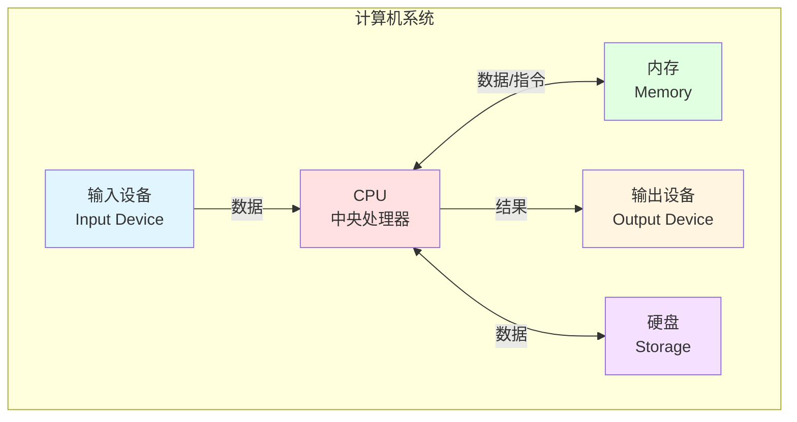
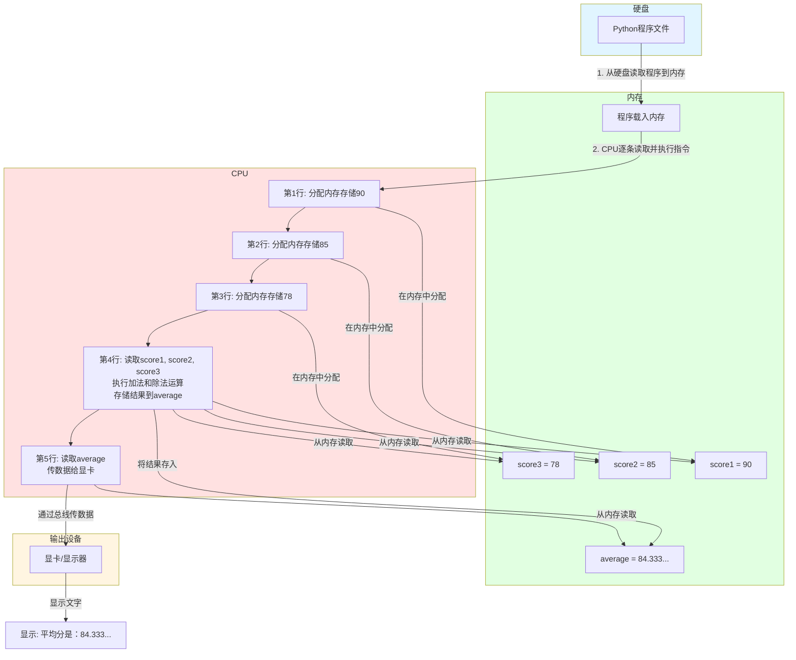

# 第18章 计算机体系结构

## 本章导读

在前面的章节中，我们学习了Python编程的各个方面：从变量和函数，到图形界面和数据处理。你可能会有疑问：

- **计算机是如何执行这些Python代码的？**
- **变量存储在哪里？**
- **当我们输入数据时，计算机内部发生了什么？**

这一章，我们将打开计算机的"外壳"，了解它内部是如何工作的。我们会发现，之前学过的很多知识，都与计算机的内部结构密切相关！

## 什么是计算机体系结构？

**计算机体系结构**是指计算机的组成部件以及这些部件如何协同工作。

想象一下，你的身体就是一个"计算机"：
- **大脑** = CPU（中央处理器），负责思考和做决定
- **眼睛/耳朵** = 输入设备，接收外界信息
- **嘴巴/手势** = 输出设备，向外界表达信息
- **记忆** = 内存和硬盘，存储信息
- **神经** = 总线，在各个部件之间传递信息

> **👨‍🏫 给家长的Tips**
>
> 用人体做类比非常适合孩子理解：
> - 问孩子："如果我想踢足球，大脑会给腿发送什么指令？"（控制信号）
> - "你记得的事情，哪些是短期的？哪些是长期的？"（内存 vs 硬盘）
> - "如果你不复习，会忘记学过的内容吗？"（内存的易失性）

## 计算机的五大组成部分

计算机由五个主要部分组成：



让我们逐一了解每个部分，并联系我们已经学过的Python知识！

### 1. 输入设备（Input Devices）

**输入设备**是让计算机接收信息的设备。

#### 常见的输入设备
- **键盘**：输入文字和命令
- **鼠标**：点击和移动
- **触摸屏**：手指操作
- **麦克风**：输入声音
- **摄像头**：输入图像

#### 与我们学过的知识联系

还记得我们学过的**输入程序**吗？

**第2章：输入与输出**
```python
name = input("请输入你的名字：")
print(f"你好，{name}！")
```

当我们运行这个程序时：
1. **键盘**（输入设备）接收你敲击的名字
2. 通过**总线**传给**CPU**
3. CPU处理后将结果传给**显卡**
4. **显示器**（输出设备）显示"你好，xxx！"

**第14章：命令行程序**
```python
import sys

name = sys.argv[1]  # 从命令行接收参数
print(f"你好，{name}！")
```

这里，命令行参数也是一种**输入**，通过键盘输入命令传递给程序。

**第16章：图形界面程序**
```python
import tkinter as tk

def on_click():
    name = entry.get()  # 从输入框获取文本
    label.config(text=f"你好，{name}！")

root = tk.Tk()
entry = tk.Entry(root)  # 输入框
entry.pack()
button = tk.Button(root, text="提交", command=on_click)
button.pack()
label = tk.Label(root, text="")
label.pack()
root.mainloop()
```

在这个GUI程序中：
- **输入框**（Entry组件）是屏幕上的"虚拟输入设备"
- 你在输入框输入字符，这些字符被输入设备接收
- 点击按钮后，程序获取输入框的内容

> **👨‍🏫 给家长的Tips**
>
> 引导孩子思考：
> - "无论是命令行还是图形界面，都需要输入设备。为什么图形界面更友好？"
> - "触摸屏既是输入设备又是输出设备，你知道吗？"
> - "想象一下，如果没有输入设备，我们能和计算机交流吗？"

### 2. 输出设备（Output Devices）

**输出设备**是计算机向外界展示信息的设备。

#### 常见的输出设备
- **显示器**：显示图像和文字
- **打印机**：打印纸质文档
- **扬声器**：播放声音
- **投影仪**：投射大屏幕

#### 与我们学过的知识联系

**第2章：print输出**
```python
print("Hello, World!")
```

当我们执行`print()`时：
- CPU计算要显示的内容
- 通过总线将数据传给**显卡**
- 显卡将数据转换为显示信号
- **显示器**接收信号，显示文字

**第15章：报表程序**
```python
import matplotlib.pyplot as plt

x = [1, 2, 3, 4, 5]
y = [10, 20, 15, 25, 30]

plt.plot(x, y)
plt.show()  # 显示图表
```

这里的图表显示也是**输出**：
- matplotlib库生成图表数据
- 通过显示器展示给你看

**第16章：图形界面**
```python
label.config(text="你好！")
```

在GUI程序中：
- 组件（Label、Button等）显示在**显示器**上
- 它们的变化（文字、颜色等）都是**输出**

> **练习1：分类游戏**

将下列设备分类为输入设备、输出设备，或两者都是：
- 键盘
- 鼠标
- 显示器
- 打印机
- 扫描仪
- 摄像头
- 音箱
- 触摸屏

<details>
<summary>👉 点击查看答案</summary>

**答案**：
- **输入设备**：键盘、鼠标、扫描仪、摄像头
- **输出设备**：显示器、打印机、音箱
- **两者都是**：触摸屏（既是输入又是输出）
</details>

### 3. 内存（Memory/RAM）

**内存**（Random Access Memory，随机存取存储器）是计算机的**短期记忆**。

#### 内存的特点
- **速度快**：CPU读写内存非常快
- **容量有限**：通常8GB、16GB、32GB等
- **易失性**：断电后数据会丢失

#### 与我们学过的知识联系

还记得我们学过的**变量**吗？

**第3-5章：变量（字符串、数字、布尔值）**
```python
name = "小明"       # 字符串变量
age = 10           # 数字变量
is_student = True  # 布尔变量
```

当我们创建这些变量时：
- 变量存储在**内存**中
- 每个变量都有一个**内存地址**
- Python自动管理内存，我们不需要手动分配

> **👨‍🏫 给家长的Tips**
>
> 用"书包"类比内存：
> - 书包空间有限（内存容量有限）
> - 随时可以拿书出来用（读写快）
> - 回家后书包里的书要拿走（易失性，断电数据丢失）
> - 家里的书柜就像硬盘（容量大，永久存储）

**练习2：计算内存占用**

不同类型的变量占用内存不同（大致数值）：

| 变量类型 | 示例 | 占用内存（估算） |
|---------|------|-----------------|
| 整数（int） | age = 10 | 约28字节 |
| 浮点数（float） | price = 3.14 | 约24字节 |
| 字符串（str） | name = "Python" | 约50字节 |
| 布尔值（bool） | flag = True | 约28字节 |
| 列表（list） | [1, 2, 3] | 约56字节 + 元素大小 |

**问题**：如果你的计算机有16GB内存，大约可以存储多少个整数变量？

<details>
<summary>👉 点击查看答案</summary>

**解答**：
1. 16GB = 16 × 1024MB = 16,384MB
2. 16,384MB = 16,777,216KB
3. 16,777,216KB = 17,179,869,184字节
4. 每个整数约28字节
5. 可存储的整数数量 ≈ 17,179,869,184 ÷ 28 ≈ **613,566,756个**

也就是说，16GB内存可以存储约**6亿个**整数变量！

> **思考**：虽然可以存储这么多变量，但实际编程时我们不会创建这么多。为什么？
>
> **答案**：因为程序还有其他数据需要存储，而且变量太多会让程序难以管理。
</details>

**第10-11章：列表和字典**

```python
# 列表
scores = [90, 85, 78, 92, 88]

# 字典
student = {"name": "小明", "age": 10, "grade": "五年级"}
```

列表和字典也存储在**内存**中：
- 它们占用更多内存（因为要存储多个元素）
- 当列表很大时（如100万个元素），会占用大量内存

> **练习3：大列表的内存占用**

如果一个列表存储100万个学生的成绩，大约占用多少内存？

<details>
<summary>👉 点击查看答案</summary>

**解答**：
1. 每个整数（成绩）约28字节
2. 列表本身还有一些额外开销
3. 总内存 ≈ 1,000,000 × 28字节 ≈ 28,000,000字节 ≈ **28MB**

100万个成绩占用约28MB内存，这对于16GB的计算机来说只是很小的一部分！
</details>

### 4. 硬盘（Storage/Hard Drive）

**硬盘**是计算机的**长期记忆**。

#### 硬盘的特点
- **容量大**：通常500GB、1TB、2TB等
- **速度慢**：比内存慢得多
- **非易失性**：断电后数据仍然保存

#### 与我们学过的知识联系

还记得我们学过的**文件操作**吗？

**第13章：JSON文件存储**
```python
import json

# 保存课表到文件
schedule = {
    "周一": ["语文", "数学", "英语"],
    "周二": ["数学", "语文", "体育"]
}

with open("schedule.json", "w", encoding="utf-8") as f:
    json.dump(schedule, f)

# 从文件读取课表
with open("schedule.json", "r", encoding="utf-8") as f:
    loaded_schedule = json.load(f)
```

在这个过程中：
1. `schedule`字典存储在**内存**中
2. `json.dump()`将数据写入**硬盘**（schedule.json文件）
3. 关闭程序后，数据仍然保存在硬盘上
4. 下次运行时，用`json.load()`从硬盘读取数据

> **👨‍🏫 给家长的Tips**
>
> 用"笔记本"类比硬盘：
> - 笔记本可以记很多东西（容量大）
> - 写字速度比脑子想得慢（速度慢）
> - 合上本子，内容还在（非易失性）
> - 想复习时，打开本子就能看到（读取数据）

**内存 vs 硬盘对比**

| 特性 | 内存（RAM） | 硬盘（Storage） |
|------|------------|----------------|
| 速度 | 非常快 | 较慢 |
| 容量 | 较小（8-32GB） | 很大（500GB-2TB） |
| 价格 | 较贵 | 较便宜 |
| 断电后 | 数据丢失 | 数据保留 |
| 用途 | 存储正在运行的程序和数据 | 永久存储文件 |

**为什么需要两者？**

想象一下，如果只有硬盘，没有内存：
- 每次操作都要读写硬盘，速度会非常慢
- 计算机运行会变得很卡

如果只有内存，没有硬盘：
- 关机后所有数据都会丢失
- 无法保存照片、文档等文件

> **练习4：估算硬盘容量**

如果一张照片占3MB空间，1TB的硬盘可以存储多少张照片？

<details>
<summary>👉 点击查看答案</summary>

**解答**：
1. 1TB = 1,024GB = 1,048,576MB
2. 可存储照片数 = 1,048,576MB ÷ 3MB ≈ **349,525张**

1TB硬盘可以存储约**35万张**照片！
</details>

### 5. CPU（中央处理器）

**CPU**（Central Processing Unit，中央处理器）是计算机的**大脑**，负责执行所有计算和控制操作。

#### CPU的特点
- **速度快**：以GHz为单位（如3.2GHz，表示每秒执行32亿个周期）
- **智能**：能执行复杂的计算和逻辑判断
- **控制中心**：指挥其他所有部件协同工作

#### 与我们学过的知识联系

**第4章：数学运算**
```python
result = 5 + 3  # 加法
result = 10 * 2  # 乘法
result = 20 / 4  # 除法
```

当我们执行这些运算时：
- CPU的**算术逻辑单元（ALU）**执行计算
- 每次运算只需要几个CPU周期（几纳秒）

> **练习5：计算CPU运算能力**

如果你的CPU主频是3.2GHz，它1秒内可以执行多少次加法运算？

<details>
<summary>👉 点击查看答案</summary>

**解答**：
1. 3.2GHz = 3,200,000,000 Hz（每秒32亿个周期）
2. 假设每次加法需要1个周期（简化计算）
3. 1秒可以执行约**32亿次**加法运算！

人类1秒可能只能做1-2次加法，而CPU可以做32亿次！这就是为什么计算机这么快！
</details>

**第6-8章：程序控制（顺序、条件、循环）**

```python
# 顺序执行
a = 5
b = 10
c = a + b

# 条件判断
if score >= 60:
    print("及格")
else:
    print("不及格")

# 循环
for i in range(100):
    print(i)
```

CPU如何执行这些程序？

1. **取指令**：从内存中读取程序指令
2. **译码**：理解指令要做什么
3. **执行**：执行指令（计算、判断、跳转等）
4. **写回**：将结果写回内存

这个过程每秒重复几十亿次！

> **👨‍🏫 给家长的Tips**
>
> 用"厨师"类比CPU：
> - 厨师根据菜谱（程序）做菜
> - 按照菜谱的步骤（顺序执行）
> - 根据情况调整（条件判断）
> - 重复切菜动作（循环）
> - 厨师的速度越快，做菜越快（CPU主频）

**多核CPU**

现代CPU通常有多个"核心"（core），如4核、6核、8核。

- **单核**：一次只能做一件事
- **多核**：可以同时做多件事（并行处理）

```python
# 模拟多核处理（实际需要使用多进程/多线程库）
# 这个例子只是概念演示
def task1():
    for i in range(1000):
        result = i * i

def task2():
    for j in range(1000):
        result = j + j

# 单核：先执行task1，再执行task2
# 多核：task1和task2可以同时执行
```

> **练习6：多核的优势**

如果CPU有4个核心，处理4个任务（每个任务需要1秒）：
- **单核CPU**需要多少秒？
- **4核CPU**需要多少秒？

<details>
<summary>👉 点击查看答案</summary>

**解答**：
- **单核CPU**：4秒（因为只能一个接一个执行）
- **4核CPU**：1秒（因为可以同时执行4个任务）

这就是为什么多核CPU更快！
</details>

## 计算机如何执行Python程序？

现在我们了解了计算机的各个部件，让我们看看它们如何协同工作来执行一个Python程序。

### 示例：计算平均分

```python
# 程序：计算三个成绩的平均分
score1 = 90
score2 = 85
score3 = 78
average = (score1 + score2 + score3) / 3
print(f"平均分是：{average}")
```

**执行过程**：



> **👨‍🏫 给家长的Tips**
>
> 这个流程图非常重要！
> - 让孩子理解：程序不是"一次性"执行的，而是"一步一步"执行的
> - 每一步都需要CPU、内存、输入/输出设备的协同工作
> - 可以用"做菜流程"类比：买菜→洗菜→切菜→炒菜→装盘

## 综合练习：设计你的计算机

现在你已经了解了计算机的各个部件，让我们设计一台计算机！

### 练习7：计算机配置选择

假设你要买一台计算机用于学习Python，请选择合适的配置：

| 部件 | 选项A | 选项B | 选项C | 你的选择 | 原因 |
|------|-------|-------|-------|---------|------|
| CPU | 双核2.0GHz | 四核3.0GHz | 八核4.0GHz | | |
| 内存 | 8GB | 16GB | 32GB | | |
| 硬盘 | 256GB SSD | 512GB SSD | 1TB SSD | | |
| 输入设备 | 标准键盘 | 机械键盘 | 游戏键盘 | | |
| 输出设备 | 普通显示器 | 高清显示器 | 4K显示器 | | |

<details>
<summary>👉 点击查看参考答案</summary>

**参考答案**：

| 部件 | 推荐选择 | 原因 |
|------|---------|------|
| CPU | 四核3.0GHz | 学习Python足够，性价比高 |
| 内存 | 16GB | 可以运行多个程序，不会卡顿 |
| 硬盘 | 512GB SSD | 存储课程和作业足够，SSD速度快 |
| 输入设备 | 机械键盘 | 手感好，适合长时间编程 |
| 输出设备 | 高清显示器 | 清晰舒适，保护眼睛 |

> **注意**：这只是学习Python的配置。如果要玩大型游戏或做视频剪辑，需要更高的配置。
</details>

### 练习8：连接知识点

让我们把之前学过的Python知识和计算机硬件联系起来：

1. **变量**（第3-5章）存储在_____
2. **文件**（第13章）存储在_____
3. **print()**输出到_____（设备）
4. **input()**从_____（设备）接收
5. **运算**（第4章）由_____执行
6. **条件判断**（第7章）由_____的_____单元执行
7. **循环**（第8章）由_____控制重复执行

<details>
<summary>👉 点击查看答案</summary>

**答案**：
1. 内存
2. 硬盘
3. 显示器（输出设备）
4. 键盘（输入设备）
5. CPU
6. CPU的算术逻辑单元（ALU）
7. CPU
</details>

### 练习9：创意项目

设计一个Python程序，展示你对计算机硬件的理解！

**项目想法**：
- **计算机硬件测验**：用GUI设计一个测验程序，问用户关于计算机硬件的问题
- **硬件信息显示**：用Python读取并显示你计算机的硬件信息（CPU型号、内存大小等）
- **资源监控器**：编写一个程序，实时显示CPU和内存使用情况

**示例框架**：
```python
import tkinter as tk
import psutil  # 需要安装：pip install psutil

def show_info():
    cpu_percent = psutil.cpu_percent()
    memory = psutil.virtual_memory()
    mem_percent = memory.percent

    info_text = f"""
    计算机硬件信息：
    ─────────────────
    CPU使用率：{cpu_percent}%
    内存使用率：{mem_percent}%
    内存总量：{memory.total / (1024**3):.1f} GB
    已用内存：{memory.used / (1024**3):.1f} GB
    """
    label.config(text=info_text)

root = tk.Tk()
root.title("计算机硬件信息")

button = tk.Button(root, text="刷新信息", command=show_info)
button.pack()

label = tk.Label(root, text="点击按钮查看信息", justify="left")
label.pack()

root.mainloop()
```

> **👨‍🏫 给家长的Tips**
>
> 这个项目需要安装`psutil`库：
> - 在命令行输入：`pip install psutil`
> - 这是一个很好的实践项目，让孩子看到真实的硬件数据
> - 可以问孩子："为什么CPU使用率会变化？"
> - "运行什么程序会让CPU使用率升高？"

## 本章小结

### 我们学到了什么？

1. **计算机的五大组成部分**：
   - 输入设备：键盘、鼠标等
   - 输出设备：显示器、打印机等
   - 内存：短期存储，速度快但易失
   - 硬盘：长期存储，容量大但速度慢
   - CPU：大脑，执行计算和控制

2. **Python知识与硬件的联系**：
   - 变量 → 内存
   - 文件 → 硬盘
   - print() → 输出设备（显示器）
   - input() → 输入设备（键盘）
   - 运算 → CPU的ALU
   - 控制结构 → CPU的控制单元

3. **程序执行过程**：
   - 硬盘 → 内存 → CPU → 输出设备
   - 所有部件协同工作

### 重要概念对比

| 概念 | 计算机硬件 | Python对应 |
|------|----------|-----------|
| 短期记忆 | 内存（RAM） | 变量、列表、字典 |
| 长期记忆 | 硬盘 | 文件、JSON |
| 思考 | CPU | 运算、条件判断、循环 |
| 感觉 | 输入设备 | input() |
| 表达 | 输出设备 | print() |

### 给家长的辅导建议

1. **实物演示**：
   - 如果可以，打开一台旧电脑，让孩子看到真实的硬件部件
   - 指着内存条、硬盘、CPU，讲解它们的作用

2. **类比教学**：
   - 人体类比：大脑=CPU，记忆=内存/硬盘，感官=输入/输出
   - 厨房类比：厨师=CPU，菜谱=程序，食材=数据，锅碗瓢盆=内存

3. **联系实际**：
   - 当孩子写程序时，问："这个变量存在哪里？"
   - "为什么关闭程序后数据会丢失？"
   - "为什么要保存文件？"

4. **扩展思考**：
   - "如果计算机没有内存，只有硬盘，会怎样？"
   - "如果CPU速度慢10倍，使用计算机的体验会有什么不同？"
   - "未来的计算机会是什么样子？"

### 下一步

恭喜你完成了这本书的所有章节！

你已经从零开始，学会了：
- ✅ Python基础语法（变量、运算、数据类型）
- ✅ 程序控制结构（顺序、条件、循环）
- ✅ 数据结构（列表、字典）
- ✅ 函数和库
- ✅ 文件操作
- ✅ 命令行程序、图形界面、数据报表
- ✅ 计算机体系结构

**接下来的学习建议**：
1. **继续练习**：编程需要多动手，找一些小项目做
2. **学习更多库**：如游戏开发（Pygame）、网站开发（Flask）、数据分析（Pandas）
3. **参加竞赛**：如NOI（全国青少年信息学奥林匹克竞赛）
4. **加入社区**：和其他小程序员交流，分享作品

**记住**：
> 学习编程不是为了成为程序员，而是为了理解数字世界，培养逻辑思维，享受创造的乐趣！

祝你在编程的世界里继续探索，创造更多精彩的作品！🎉

---

**🎓 毕业快乐！你已经完成了Python基础教程的所有学习！**
